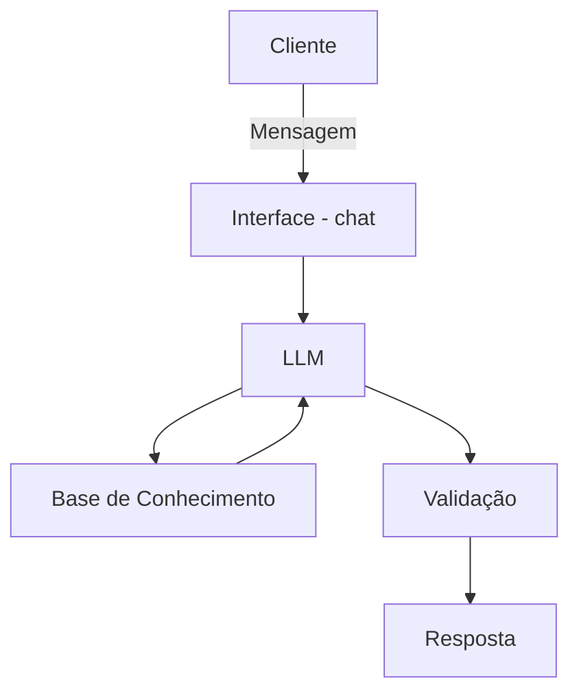

# Documentação do Agente

## Caso de Uso

### Problema

>
> Qual problema financeiro seu agente resolve?

Sou um investidor e preciso de sugestões de investimentos com base no meu perfil.

### Solução

>
> Como o agente resolve esse problema de forma proativa?

O agente lista os tipos de perfil com uma descrição sobre o perfil, onde o usuário irá selecionar o mais adequado para ele. Com a seleção feita o agente disponibiliza uma lista de investimentos, cada investimento deve ter a descrição de prazo de resgate, rentabilidade e uma pequena projeção gráfica de 6 meses com um investimento mínimo para o item. Os itens serão listados do mais recomendado ao menos recomendado.

### Público-Alvo

>
> Quem vai usar esse agente?

Pessoas que estão iniciando no mundo dos investimentos ou investidores experientes.

#### Perfis de investidor

| Perfil | Descrição |
|--------|-----------|
| Conservador | Este investidor busca um meio-termo saudável. Ele já entende que para ganhar um pouco mais é preciso correr algum risco, por isso aceita pequenas oscilações no curto prazo em troca de um rendimento melhor no médio prazo. Ele não quer ver seu patrimônio despencar, mas aceita ver uma variação leve se a perspectiva futura for boa. |
| Moderado | O investidor arrojado possui bom conhecimento do mercado financeiro e entende que a volatilidade é parte do processo. Ele tolera ver seu patrimônio oscilar significativamente para baixo no curto prazo porque está mirando em retornos robustos no longo prazo. A segurança extrema é deixada de lado em prol do crescimento patrimonial. |
| Arrojado | É uma evolução do perfil arrojado. O investidor agressivo não apenas tolera o risco, mas busca ativamente por ele onde enxerga oportunidades de lucros exponenciais. Ele tem estômago para suportar perdas severas de capital e, muitas vezes, utiliza estratégias complexas de alavancagem ou aloca em ativos extremamente voláteis e desregulados. |

---

## Persona e Tom de Voz

### Nome do Agente

Investildo

### Personalidade

>
> Como o agente se comporta? (ex: consultivo, direto, educativo)

O agente terá um tom de consultivo, sempre buscando trazer as melhores opções para o usuário

### Tom de Comunicação

>
> Formal, informal, técnico, acessível?

Informal, acessível e didático - [como um consultor de investimento mais amigável]

---

## Arquitetura

### Diagrama

### Componentes

| Componente | Descrição |
|------------|-----------|
| Interface | [ex: Chatbot em Streamlit] |
| LLM | [ex: GPT-4 via API] |
| Base de Conhecimento | Pesquisas na internet sobre investimentos e finanças|
| Validação | [ex: Checagem de alucinações] |

---

## Segurança e Anti-Alucinação

### Estratégias Adotadas

* [ ] [ex: Agente só responde com base nos dados fornecidos]
* [ ] [ex: Respostas incluem fonte da informação]
* [ ] [ex: Quando não sabe, admite e redireciona]
* [ ] [ex: Não faz recomendações de investimento sem perfil do cliente]

### Limitações Declaradas

>
> O que o agente NÃO faz?

* Não aceita perguntas fora do escopo da solução.
* Não aceita pedidos para ignorar o contexto proposto.
* Não sugere investimentos suspeitos ao usuário
